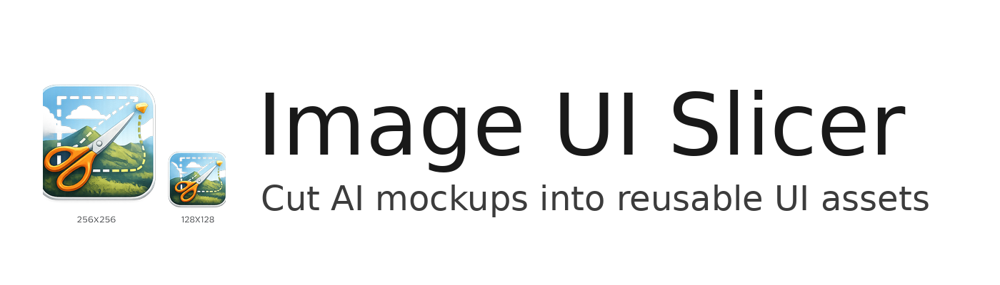

# Photo Cutter

[](https://github.com/Awetspoon/Photo-Cutter/releases/latest)
[](https://github.com/Awetspoon/Photo-Cutter/actions/workflows/ci.yml)
[](LICENSE)
[](https://github.com/Awetspoon/Photo-Cutter/releases/latest)

Windows desktop app for cutting transparent PNG assets from UI mockups and screenshots.



## Download

- Latest release: [PhotoCutter.exe](https://github.com/Awetspoon/Photo-Cutter/releases/latest)
- Distribution format: single-file Windows executable (`PhotoCutter.exe`)

## Core Features

- Selection tools: `Select`, `Lasso`, `Polygon`, `Shapes`
- Reusable custom shapes: save, apply, duplicate, paste
- Brush refinement (`Brush +` / `Brush -`) on active selections and cutouts
- Inspector preview with optional split compare
- Cutout Gallery for fast visual review
- Export presets, naming options, edge/outline controls
- Project save/load support (`.iusproj`)

## Quick Start

1. Open an image.
2. Draw a selection with `Shapes`, `Lasso`, or `Polygon`.
3. Click `Commit Cutout`.
4. Optional: save selection as reusable shape.
5. Export selected/all cutouts as PNG.

## Build From Source

### Requirements

- Windows 10/11
- .NET SDK 8.0.124+ (see `global.json`)

### Restore

```powershell
dotnet restore .\\solution\\ImageUiSlicer\\ImageUiSlicer.csproj
```

### Run

```powershell
dotnet run --project .\\solution\\ImageUiSlicer\\ImageUiSlicer.csproj
```

### Build

```powershell
dotnet build .\\solution\\ImageUiSlicer\\ImageUiSlicer.csproj -c Release
```

## Releasing

Tag and push a semantic version to publish a GitHub Release:

```powershell
git tag v1.1.1
git push origin v1.1.1
```

Release workflow uploads one asset: `PhotoCutter.exe`.

Detailed process: [docs/RELEASE.md](docs/RELEASE.md)

## Repository Structure

```text
.github/                    # workflows, templates, community standards
docs/                       # release guide, changelog, specs, archives
solution/ImageUiSlicer/     # WPF app source and assets
```

## Project Standards

- Contributing: [.github/CONTRIBUTING.md](.github/CONTRIBUTING.md)
- Security: [.github/SECURITY.md](.github/SECURITY.md)
- Changelog: [docs/CHANGELOG.md](docs/CHANGELOG.md)
- Code of conduct: [.github/CODE_OF_CONDUCT.md](.github/CODE_OF_CONDUCT.md)

## License

MIT. See [LICENSE](LICENSE).
